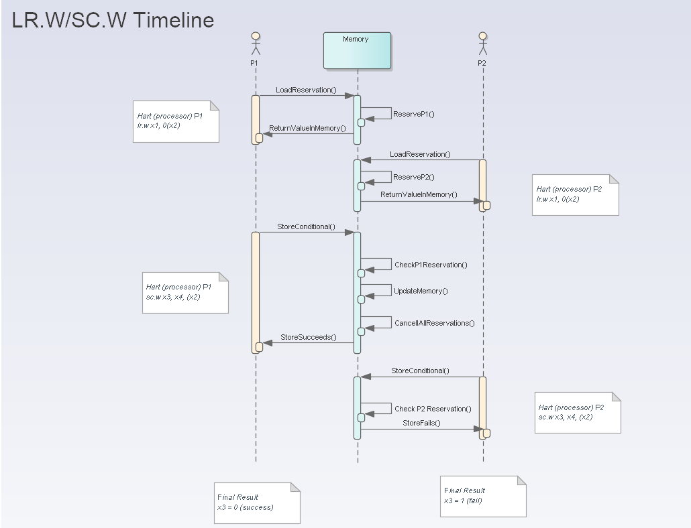

# Assignment 1 - Multi-Core Processor

## Goals
 *  Use the knowledge gained from earlier labs to implement two complete pipelined RV32IA processors which can run separate programs on a shared memory.
 *  Gain experience writing technical reports.

In the labs for this course, you have sucecssively built up capability for the RV32I instruction set.  Now you will extend this to a __multicore__ processor network, where two instances of your processor will coexist on the same silicon.  We make use of the ```lr.w``` and ```sc.w``` atomic instructions, and a special memory.  

See the background section below for more theory.

# Question
Create a pipelined RV32IA processor which implements enough of the instructions specified in Volume 1 Sections 2.1-2.6 of the RISC-V ISA Specification <https://riscv.org/technical/specifications/> to execute the programs supplied with this assignment and add the following features (with each improvement including the functionality from previous part):

1. (2 marks) Add the Atomic series "A" series instructions for the extension ```Zalrsc```, as described in Section 13.2 of the specification.  Only these two instructions need be implemented: Load reservation: ```lr.w```, and Store conditional: ```sc.w```
    * You may submit a single-cycle version for reduced credit (1 mark maximum)
    
1. (1 mark) Modify the RAM memory module to support two write accesses and two read accesses concurrently.  This should be placed into your processor ```.sv``` file, not the testbench file. Decide on a priority scheme when both attempt to write in the same cycle, and document it in your report.

1. (2 marks) Add a reservation vector for each core, where the appropriate reservation (based on the address) is set for that core when the ```lr.w``` instruction is executed, __all__ reservations for that address are cleared when a ```sc.w``` instruction is set, and the appropriate status code is returned to the calling core.  Document the dataflow path, and describe how you handle pipeline issues.

1. (5 marks) Report (see below)

## Test files
The machine marked parts will consider correctness and performance.  Use the ```make result FIRMWARE=test_filename.hex``` to test a single result, and use ```make allresults``` to run the whole test suite.
```
---------------------------------------------------
Results...
cat results.log
Source file: test1-hart1-only.s    Sim file: test1-hart1-only.log
Total failures = 0 of 3 tests

Source file: test2-hart2-only.s    Sim file: test2-hart2-only.log
Total failures = 0 of 3 tests

Source file: test3-samecode-bothharts.s    Sim file: test3-samecode-bothharts.log
Total failures = 0 of 10 tests

Source file: test4-race-hart1-slowslow.s    Sim file: test4-race-hart1-slowslow.log
Total failures = 0 of 9 tests

Source file: test5-race-hart2-slowslow.s    Sim file: test5-race-hart2-slowslow.log
Total failures = 0 of 9 tests

Source file: test6-race-hart1-slow.s    Sim file: test6-race-hart1-slow.log
  h0:x2 expected 193  got  192
  h0:x5 expected 1  got  0
  h0:x6 expected 193  got  192
  h1:x6 expected 193  got  0
Total failures = 4 of 9 tests
```

## Reports
 * Your report should be a 4 page document explaining your design (appendices with no page limit can be included).
 *  Your report should be in [A4 IEEE format](https://www.ieee.org/conferences/publishing/templates.html) with the default font sizes, and organized under the following section headings: Introduction, Background, Architecture, Results, Discussion, Conclusion, References, Appendices.
 *  Your report should document the datapath design of all the major components, including a high-level description and/or diagram, and specific implementation of the major subsystems.  This is a narrative description to as given to a fellow engineer, and not merely a copy of code.
 *  Include a performance description which includes maximum clock frequency and number of cycles required to execute each program you test. You need to provide supporting evidence which can convince the reader that you have completed the design and it works via appendices containing code listings, simulations and log files. The appendices don't count in the page limit. 
 * Comment on whether your result is a good one and what could be done to further improve performance.
 *  [Dennis et al.](https://ieeexplore.ieee.org/abstract/document/8303926) and [Miyazaki et al.](https://arxiv.org/abs/2002.03568) are two examples of well-written papers describing a RISC-V processor (you could following a similar style for your report). [Singh et al.](https://ieeexplore.ieee.org/document/9250850) is an example of a poorly written paper.
 *  You should assume that the reader is familiar computer architecture in general, but not necessarily the the RISC-V instruction set or your architecture. Write the report as an academic-style paper like the examples provided.
 *  If you don't finish the entire question, still report on your answer. Partial marks will be awarded.
 *  No extensions will be granted and penalty for a late submission is deduction of 5% of the maximum mark for each calendar day after the due date. After ten calendar days late, a mark of zero will be awarded.

# Submission 
Your assignment should be submitted online as two separate files (a .pdf and .sv file) before the due date. Refer to Canvas for the rubric and submission instructions.
 * Report: a pdf report as described above.
 * Design: a System Verilog file containing your pipelined processor and memory implementation, using the name ```nerv-atomic.sv```.


# Background
When multiple processors share resources, like memory, there is the possibility more than two cores try to use it at the same time.  This can break software in unexpected ways.  Therefore, it is important to create _memory protection_ capabilities enforced in hardware to ensure only one core at a time uses a critical resource.  Hardware enforcement of multiple processors creates so-called Atomic instructions.

The most critical phase of multi-core processing is when two processors want to read, edit and store to the piece of memory.  For example, imagine your bank account is a single number in the memory of a multi-core processor.  Each time you get paid, the balance must go up, and each time you buy something, the balance goes down.  Each transaction is a read-add-write cycle, and it's vital that the entire cycle complete before another one begins.

Several such schemes exist, and RISC-V supports two of them: Compare-and-store instructions, and Reservation loads.  This assignment will focus on the latter, and is described in more detail here: <https://en.wikipedia.org/wiki/Load-link/store-conditional>.

In a reservation system, each processor must _reserve_ a block of memory during the read phase.  Then it is free to edit the read valid (add or subtract your bank balance), and attempt to write it back.  The _conditional store_ changes the memory only if the reservation is valid.  Any writes by any processors to a reserved block cancel the reservation regardless of if the memory was actually changed.

## RISC-V Implementation
In RISC-V, processor cores are known as __harts__.  We will use hart, processor, and core interchangeably.

In the RISC-V the reservation system is implemented using ```lr.w``` and ```sc.w``` instructions.  The ```lr.w``` loads from memory and sets a reservation bit.  The ```sc.w``` stores to memory __only__ if the current processor has a reservation, and saves the status (success or failure) to a register.  Any processor using ```sc.w``` cancels the reservation for all processors.

Below is a timeline for two processors attempting to modify the same memory.  P1 will succeed while P2 will fail.



## Examples
Imagine the shared memory to be protected is the value of a bank account, initially containing $100.  Processor P1 will attempt to add $500 to the account due to a paycheck, and P2 will attempt to subtract $10 due to a purchase.

Imagine core P2 does nothing; only one core (P1) reserves the memory using ```lr.w```, and makes a change (adding money), then write to memory using ```sc.w```. P1 is notified of a successful write, since it still had the reservation.  The reservation is cancelled after the write.  The balance contains $600.

Now imagine two cores (P1 and P2) attempt to modify the memory.  P1 requests a reservation, and gets it along with the current memory value ($100). Later P2 requests a reservation and also gets it along with the same memory value ($100).  Even later, P1 adds the paycheck amount, attempts to write a new value to memory. This succeeds since it still has a reservation, and all reservations are cancelled now.  Lastly, P2 has subtracted the purchase and attempts to write to memory; this fails since all reservations had been cancelled.  P2's value is ___not___ saved, and P2 is notified of the failure.  Now the balance in memory is now ($600). P2 can try again later, getting a new copy of the memory and new reservation using ```lr.w``` each time. P1 does nothing more, but P2 eventually succeeds, leaving the balance of $590.

Similarly if P2 writes its update before P1, P2's value is saved and P1's fails.  The order the reservation is acquired (```lr.w``` instruction) does not matter, only the order of the write (```sc.w``` instruction) matters.  In this case the balance is now $90, and P1 must attempt to get a reservation again.

Finally, a special case occurs when __both__ cores P1 and P2 try to write back in the same cycle.  Then we must implement a priority scheme.  A simple scheme would be to always allow P1 to succeed in this case.  Alternatively, we could alternate priority, or randomly assign it.  No matter what the scheme, only __one__ processor can successfully update the memory, and all reservations must be cancelled after the write.

## Multiple reservations
In the example above, we implied there was only a single reservation possible.  In this case we are effectively reserving the entire memory each time.  A better system is to assign blocks of memory to individual reservations.  In this lab, we will use a 4k-aligned reservation, that is the reservation number is simply shifted by 12-bits

```assign resv_id = addr >> 12;```

Therefore, we should not think of _the_ reservation, but the _block of bytes_ under a reservation.  

This means, for example, if core P1 performs a load-reserve at address ```0x0000_00120``` and P2 reserves a block at ```0x0000_0018```, they are in fact reserving the same block.  A subsequent ```sc.w``` must cancel both reservations.  On the other hand, if core P1 performs a load-reserve at address ```0x0000_00120``` and P2 reserves a block at ```0x0000_1018```, they are not reserving the same block.  A subsequent ```sc.w``` must must not cancel the other's reservation.

You may choose any reservation system you wish, but one way is a vector of bits
```
reg [RESV_BITS-1:0] core0_reservation;
reg [RESV_BITS-1:0] core1_reservation;

... some stuff
if(conditions_are_right_for_core0)
  core0_reservation[resv_id] <= the_right_value;

... some more stuff

```

## Memory block support for reservation
In this implementation, the reservation system must be atomic.  That is, while any core may request the reservation at any time (even simultaneously), the conditional store ```sc.w``` must only allow a single hart to write, and must cancel all harts.  A block may be reserved simultaneously by multiple processor cores, since we never know which store will succeed. 

## Compiling RISC-V code for multiple cores
Multiple cores, or _harts_ in the specification, requires some special software considerations.  In particular, the assembly code has not one, but _two_ programs, and the CPUs must place the code in the appropriate place.  Thus each core must start its ```pc``` register at a different place.  After all, if the CPUs didn't have separate starting points, they would both run the exact same code!

### Verilog Coding
In the ```nerv.sv``` file from lab 5/6, the starting address for the first instruction was defined in the module parameter ```RESET_ADDR```, as shown below
```
module nerv #(
	parameter [31:0] RESET_ADDR = 32'h 0000_0000,
	parameter integer NUMREGS = 32
) (
... more code...
```
The instatiation in ```testbench.sv``` for each core must be modified to give a unique starting address
```
nerv #(.RESET_ADDR(32'h 0000_0000)) dut_0 (
... more code ...

nerv #(.RESET_ADDR(32'h 0001_0000)) dut_1 (
... more code ...
```

### Assembly Coding
The linker description file ```sections.lds``` has been modified to place each code block in a new location.  As a result the assembly code, like ```firmware.s```, requires two functions, decorated with a ```.section``` keyword
```
/* this H0 section is "allocatiable, program code, executable" */
.section .text_H0,"ax",@progbits   
.global _start
_start:
    /* do stuff here for core 0/hart 0*/
    ebreak

/* this H1 section is "allocatiable, program code, executable" */
.section .text_H1,"ax",@progbits   
.global _start1
_start1:
    /* do stuff here for core 1/hart 1*/
    ebreak
```

The resulting ```firmware.hex``` file now has two blocks of code, starting at different places.  In SystemVerilog, a single ```$readmemh("firmware.hex", mem)``` will fill the memory as needed.

### Support for automatic marking
In the assembly code, we've added some support for passing the expected register values to help machine marking the results.  These decorations are simply comments at the end of each code section to indicate which hart (processor core) and the expected register value.  You may edit them for testing, but you won't be able to submit your own firmware files, so your edits won't affect your marks.

```
.section .text_H0,"ax",@progbits   /* this H0 section is "allocatiable, program code, executable" */
.global main
.global _start
_start:
    addi x1, zero, 128
    addi x3, zero, 1200
    addi x5, zero, -12  /* dummy for testing succes & fail */
    addi x4, zero, 0xc0
    lr.w x0, (x3)   
    sc.w x5, x4, (x3) 
    ebreak

/* expected result. Format is "expect" hartID ":" regID "=" finalValue  
    expect h0:x1 = 128
    expect h0:x3 = 1200
    expect h0:x4 = 0xc0
*/
```