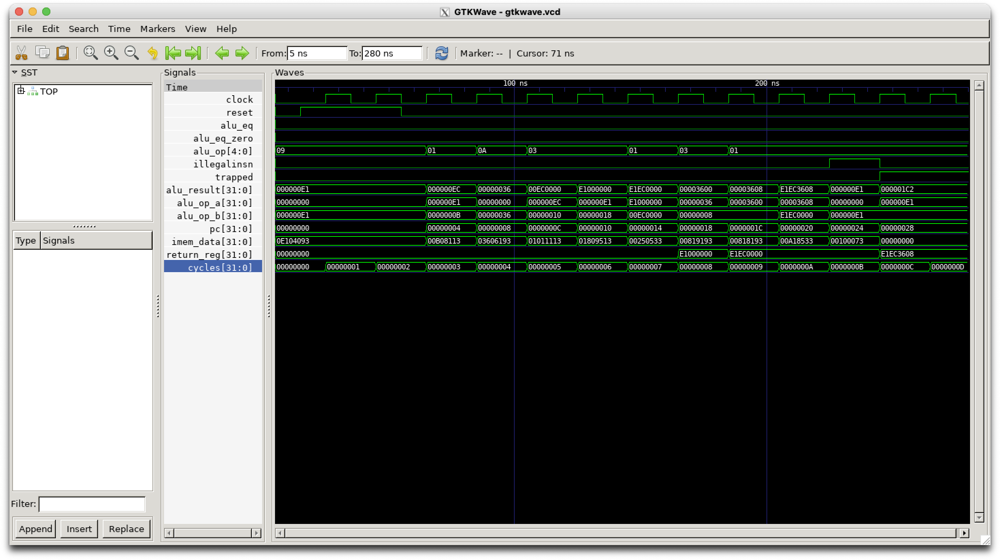
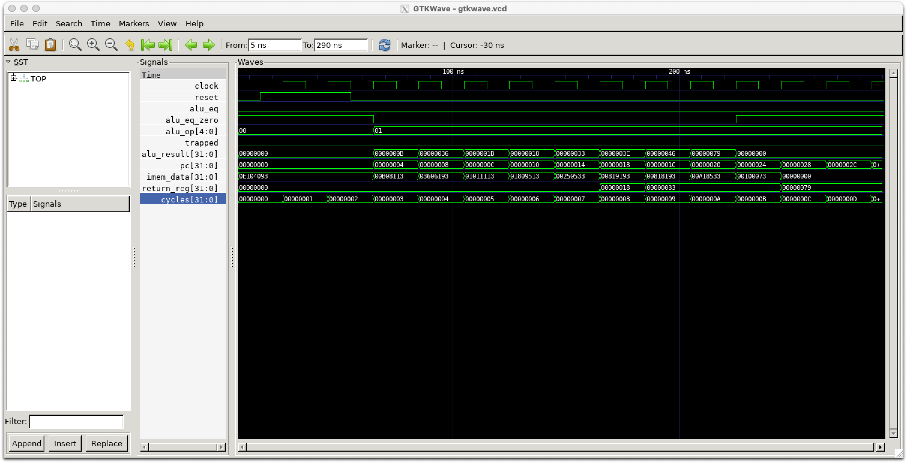

# RV32 R-type and I-type instructions

In this lab you will develop a single-cycle RISC-V (RV) processor which
can execute some R-type and I-type instructions. It will use the
ALU developed in the previous lab.

In your lab book, clearly explain the changes that you needed to make
to answer each question and include screen shots of your simulations
and terminal output.

If you have previously downloaded all the labs using 
```git clone https://github.com/phwl/elec3608-lab.git```, 
you should first type ```git pull``` to download any recent changes.
Also, make sure you can run ```xeyes``` as you will need Xwindows working in
for this lab.

## RV Program
Study the ```firmware.s``` program, listed below. 

```assembly
    .section .text
    .global _start
    _start:
    # these first three instructions are I-type
    xori x1, zero, 0xe1
    addi x2, x1, 11
    ori x3, zero, 0x36
    
    # remaining instruction types
    slli x2, x2, 16
    slli x10, x1, 24
    add x10, x10, x2
    slli x3, x3, 8
    addi x3, x3, 8
    add x10, x3, x10
    
    ebreak
```

When it is succesfully executed, you should get the golden output
provided below. When the simulation terminates, register x10
(```regfile(10)``` in the simulation which is copied to ```return_reg```)
should have the value 0xe1ec3608. You can study the execution of
the program from this figure and verify that the processor correctly
executes the assembly language instructions.



## Simulating the processor
The testbench is as below.
```python3
import pyverilator
import random
from ctypes import c_int32, c_uint32

def r(tb, reset):
    tb.io.reset = reset
    tb.clock.tick()

tb = pyverilator.PyVerilator.build('testbench.sv')
tb.start_gtkwave()
#print(tb.io)
#print(tb.internals)
tb.send_to_gtkwave(tb.io)
tb.send_to_gtkwave(tb.internals)
for i in range(14):
    r(tb, i < 2)

# check return value is correct
rr = int(tb.internals['return_reg'])
if (rr == 0xe1ec3608):
    print('Correct return_reg') 
else:
    print('Wrong return_reg {}'.format(hex(rr)))
input("Press Enter to exit...")
tb.stop_gtkwave()
```

From your host, you can run docker, compile and test as below (for Mac, please change Makefile to change the ```docker run''' command for your machine):

```bash
(base) phwl@AHJ7LDH57JP lab2-ritype % make rundocker
docker run --platform linux/amd64 -it -e DISPLAY=host.docker.internal:0 -v `pwd`:/config phwl/elec3608-base:latest
To run a command as administrator (user "root"), use "sudo <command>".
See "man sudo_root" for details.

elec3608@9bd818db44df:~$ make
riscv64-unknown-elf-gcc -march=rv32i -mabi=ilp32 -Os -Wall -Wextra -Wl,-Bstatic,-T,sections.lds,--strip-debug -ffreestanding -nostdlib -o firmware.elf firmware.s
riscv64-unknown-elf-objcopy -O verilog firmware.elf firmware.hex
python testbench.py
%Warning-CASEINCOMPLETE: rv3608a.sv:69: Case values incompletely covered (example pattern 0x1)
    casez ({insn_funct7, insn_funct3})
    ^~~~~
                         testbench.sv:72: ... note: In file included from testbench.sv
                         ... Use "/* verilator lint_off CASEINCOMPLETE */" and lint_on around source to disable this message.
make[1]: Entering directory '/config/obj_dir'
g++  -I.  -MMD -I/usr/share/verilator/include -I/usr/share/verilator/include/vltstd -DVM_COVERAGE=0 -DVM_SC=0 -DVM_TRACE=1 -faligned-new -fcf-protection=none -Wno-bool-operation -Wno-sign-compare -Wno-uninitialized -Wno-unused-but-set-variable -Wno-unused-parameter -Wno-unused-variable -Wno-shadow     -fPIC -shared --std=c++11 -DVL_USER_FINISH   -c -o pyverilator_wrapper.o ../obj_dir/pyverilator_wrapper.cpp
g++  -I.  -MMD -I/usr/share/verilator/include -I/usr/share/verilator/include/vltstd -DVM_COVERAGE=0 -DVM_SC=0 -DVM_TRACE=1 -faligned-new -fcf-protection=none -Wno-bool-operation -Wno-sign-compare -Wno-uninitialized -Wno-unused-but-set-variable -Wno-unused-parameter -Wno-unused-variable -Wno-shadow     -fPIC -shared --std=c++11 -DVL_USER_FINISH   -c -o verilated.o /usr/share/verilator/include/verilated.cpp
g++  -I.  -MMD -I/usr/share/verilator/include -I/usr/share/verilator/include/vltstd -DVM_COVERAGE=0 -DVM_SC=0 -DVM_TRACE=1 -faligned-new -fcf-protection=none -Wno-bool-operation -Wno-sign-compare -Wno-uninitialized -Wno-unused-but-set-variable -Wno-unused-parameter -Wno-unused-variable -Wno-shadow     -fPIC -shared --std=c++11 -DVL_USER_FINISH   -c -o verilated_vcd_c.o /usr/share/verilator/include/verilated_vcd_c.cpp
/usr/bin/perl /usr/share/verilator/bin/verilator_includer -DVL_INCLUDE_OPT=include Vtestbench.cpp > Vtestbench__ALLcls.cpp
g++  -I.  -MMD -I/usr/share/verilator/include -I/usr/share/verilator/include/vltstd -DVM_COVERAGE=0 -DVM_SC=0 -DVM_TRACE=1 -faligned-new -fcf-protection=none -Wno-bool-operation -Wno-sign-compare -Wno-uninitialized -Wno-unused-but-set-variable -Wno-unused-parameter -Wno-unused-variable -Wno-shadow     -fPIC -shared --std=c++11 -DVL_USER_FINISH   -c -o Vtestbench__ALLcls.o Vtestbench__ALLcls.cpp
/usr/bin/perl /usr/share/verilator/bin/verilator_includer -DVL_INCLUDE_OPT=include Vtestbench__Trace.cpp Vtestbench__Syms.cpp Vtestbench__Trace__Slow.cpp > Vtestbench__ALLsup.cpp
g++  -I.  -MMD -I/usr/share/verilator/include -I/usr/share/verilator/include/vltstd -DVM_COVERAGE=0 -DVM_SC=0 -DVM_TRACE=1 -faligned-new -fcf-protection=none -Wno-bool-operation -Wno-sign-compare -Wno-uninitialized -Wno-unused-but-set-variable -Wno-unused-parameter -Wno-unused-variable -Wno-shadow     -fPIC -shared --std=c++11 -DVL_USER_FINISH   -c -o Vtestbench__ALLsup.o Vtestbench__ALLsup.cpp
ar -cr Vtestbench__ALL.a Vtestbench__ALLcls.o Vtestbench__ALLsup.o
ranlib Vtestbench__ALL.a
g++ -fPIC -shared pyverilator_wrapper.o verilated.o verilated_vcd_c.o Vtestbench__ALL.a    -o Vtestbench -lm -lstdc++ 
make[1]: Leaving directory '/config/obj_dir'
/usr/src/pyverilator/pyverilator/pyverilator.py:805: UserWarning: tcl command "gtkwave::loadFile gtkwave.vcd" generated stderr message '\nGTKWave Analyzer v3.3.103 (w)1999-2019 BSI\n\n[5] start time.\n[10] end time.\n'
  self.gtkwave_tcl.eval('gtkwave::loadFile %s' % self.vcd_filename)
pc = 0x00000000
pc = 0x00000004
pc = 0x00000008
pc = 0x0000000c
pc = 0x00000010
pc = 0x00000014
pc = 0x00000018
pc = 0x0000001c
pc = 0x00000020
pc = 0x00000024
pc = 0x00000028
pc = 0x0000002c
Wrong return_reg 0x1fb
Press Enter to exit...
```

Note that the ```pc = xxx``` output comes from the code below. A good way to
debug your designs is to add ```$display``` messages.
```sv
$display("pc = 0x%08x", pc);
```

You need to press Enter in the terminal window to exit the program.
Note that the second last line says: "Wrong return_reg 0x1fb" 
(it should be ```0xe1ec3608```).

The plot below should appear in a window.



## Lab Questions

A starting point for an RV processor capable of executing the program
is given in ```rv3608a.sv```.

The first part includes ```constants.svh``` which has a number of definitions
for constants, RISCV opcodes and ALU function codes. The module itself
has the ```clock, reset, trap, imem_addr, imem_data``` ports. These
are supplied by the testbench in ```testbench.sv```. 

```sv
`include "constants.svh"

`default_nettype none

module rv3608a (
    input clock,
    input reset,
    output trap,

    // we have 2 external memories
    // one is instruction memory
    output  [31:0] imem_addr,
    input   [31:0] imem_data
);
```

The instruction is fetched from the instruction memory with the following
code. Note that the instruction itself is ```insn```.
```sv
    // instruction memory pointer
    assign  imem_addr = pc;
    assign  insn = imem_data;
```

All the different fields are extracted as below.
```sv
    // components of the instruction
    wire [6:0] insn_funct7;
    wire [4:0] insn_rs2;
    wire [4:0] insn_rs1;
    wire [2:0] insn_funct3;
    wire [4:0] insn_rd;
    wire [6:0] insn_opcode;

    // split R-type instruction - see section 2.2 of RiscV spec
    assign {insn_funct7, insn_rs2, insn_rs1, insn_funct3, insn_rd, insn_opcode} = insn;

    // setup for I, S, B & J type instructions
    // I - short immediates and loads
    wire [11:0] imm_i;
    assign imm_i = insn[31:20];
```

We need to support 2 different types of immediate values, the normal 12-bit
ones in ```insn[31:20]``` for I-type instructions (which are extracted into ```imm_i_sext```),
and the (unsigned) 5-bit shift values in ```insn[24:20]```. This is done
in the code below and ```imm_val``` is populated with the appropriate
immediate value. Note that the 12-bit immediate value is sign extended whereas the 5-bit value is zero-extended. 

There are subtleties in signed
and unsigned conversions which are detailed in Section 5.2 of [Standard Gotchas Subtleties in the Verilog and SystemVerilog Standards That Every Engineer Should Know](https://citeseerx.ist.psu.edu/viewdoc/download;?doi=10.1.1.174.5961&rep=rep1&type=pdf).
I have used what I think is the clearest way.

```sv
    // I - short immediates and loads                                           
    wire [11:0] imm_i;                                                          
    assign imm_i = insn[31:20];                                                 
    // sign extended imm_i                                                      
    wire [31:0] imm_i_sext = 32'(signed'(imm_i));                               
    // sign extended short immediate for shifts                                 
    wire [31:0] imm_shift = 32'(signed'({1'b0, insn[24:20]}));                  
    // use the 5-bit immediate for shifts otherwise the 12-bit one              
    wire [31:0] imm_val;                                                        
    assign imm_val =                                                            
        ({insn_funct7, insn_funct3} == `OPCODE_SLLI ||                          
         {insn_funct7, insn_funct3} == `OPCODE_SRLI ||                          
         {insn_funct7, insn_funct3} == `OPCODE_SRAI)                            
         ? imm_shift : imm_i_sext; // either a shift or an imm
 ```

The register file is declared as
```sv
    logic   [31:0] regfile [0:`NUMREGS-1];
```

The ALU is instantiated as follows, and the two inputs are specified.
```sv
    // ALU 
    assign  alu_op_a = regfile[insn_rs1];
	assign  alu_op_b = imm_val;

	alu alu_1 (
		.alu_function(alu_op),
		.op_a(alu_op_a),
		.op_b(alu_op_b),
		.result(alu_result),
		.result_eq_zero(alu_eq_zero)
	);
```

The block below is responsible for deriving the appropriate value for
```alu_op``` given the ```insn_opcode, insn_funct7``` and ```insn_funct3```.
This ```case``` statement will need to be completed to implement all the
instructions.

```sv
	// combinational assignment of alu_op
    always @* begin
		illegalinsn = 0;
		case (insn_opcode)
			0: alu_op = `ALU_ADD;	// NOP

			`OPCODE_OP_IMM: begin
				casez ({insn_funct7, insn_funct3})
					10'b zzzzzzz_000 /* ADDI  */: alu_op = `ALU_ADD;
				endcase
			end
			`OPCODE_OP: begin
				casez ({insn_funct7, insn_funct3})
					10'b 0000000_000 /* ADD  */: alu_op = `ALU_ADD;
				endcase
			end
		endcase
	end
```

Finally, registered values are implemented in the code below.
```sv
    // every cycle
    always @(posedge clock) begin
		pc <= pc + 4;
        regfile[insn_rd] <= alu_result;

        // reset
        if (reset) begin
		    pc <= 0;
        end
    end

endmodule
```
### Part 1 - I-type instructions (40%) 
The first three instruction in our test program are all immediate
instructions. Modify ```rv3608a.sv``` so they
are executed correctly by completing the ALU and any other parts required. '


### Part 2 - R-type and I-type Instructions (40%)
Implement all of the remaining instructions required to execute the
program and demonstrate that you can create the same output as the
golden output provided above. 

### Part 3 - Illegal Instruction trap (20%)
In the golden output, note that the ```trapped``` signal is asserted when
the ```ebreak``` instruction is executed. The verilator simulation
exits at that point as ```ebreak``` corresponds to an illegal
instruction. Modify your ```rv3608.sv``` so that it implements this
feature.
