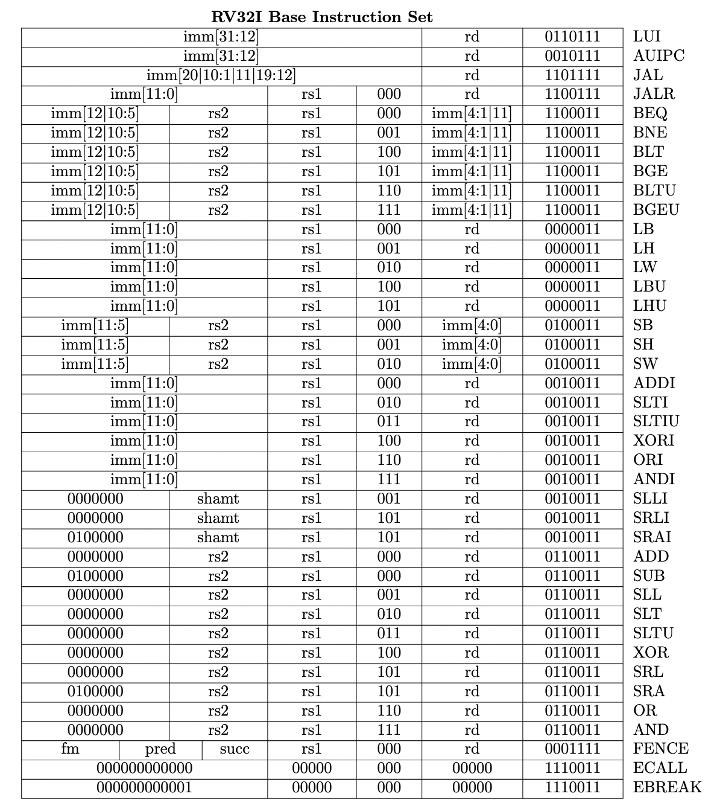

# RV32 Branch and Jump instructions

In this lab you will implement the branch and jump instructions for
a single-cycle RISC-V (RV) processor.

If you have previously downloaded all the labs using ```git clone https://github.com/phwl/elec3608-lab.git```, you should first type ```git pull``` to download any recent changes.

In your lab book, clearly explain the changes that you needed to make
to answer each question and include screen shots of your simulations
and terminal output.

## Lab Questions
### Part 1 - Datapath (20%)
Using the figures from the lectures as a starting point, draw the datapath of ```rv3608b.sv``` in your lab book, showing every control signal. In a table, describe the operation of each of the control signals.

### Part 2 - bne instruction (20%) 
Study the ```test1.s``` program, listed below. 

```assembly
.section .text
.global _start
_start:
    # these first three instructions are I-type
    addi x10, zero, 0xd0
    addi x2, zero, 2
loop:
    addi x2, x2, -1
    addi x10,x10, 1
    bne x2, zero, loop
    ebreak
```
This implements a simple loop. The ```x2``` register is first initialised
to 2 and it is decremented until it becomes zero. The x10 register is
incremented in the loop and hence the output should be ```0xd2```.

If you have any doubt as to what this program is doing, you can easily
simulate it using the [RISC-V Graphic Datapath Simulator](https://jesse-r-s-hines.github.io/RISC-V-Graphical-Datapath-Simulator/). This is a useful
tool for verifying software and datapath execution.

## Simulating the processor
First put the alu that was designed in an earlier lab in ```alu.sv```.
The testbench is as below.
```python3
import pyverilator
import random
import sys
from ctypes import c_int32, c_uint32

def r(tb, reset):
    tb.io.reset = reset
    tb.clock.tick()

opts = [opt for opt in sys.argv[1:] if opt.startswith("-")]
if "-t" in opts:
    tkmode = True
else:
    tkmode = False
if "-s" in opts:
    stepmode = True
else:
    stepmode = False
if "-h" in opts:
    print('Usage: testbench.py [-t] [-s]')
    exit(1)


tb = pyverilator.PyVerilator.build('testbench.sv')
if (tkmode):
    tb.start_gtkwave()
    tb.send_to_gtkwave(tb.io)
    tb.send_to_gtkwave(tb.internals)
i = 0
while True:
    r(tb, i < 2)
    i = i + 1
    # import pdb; pdb.set_trace()
    if (int(tb.internals['dut'].trapped)):
        break

# check return value is correct
rr = int(tb.internals['x10'])
if (rr == sum(range(21))):
    print('Correct return_reg {}'.format(hex(rr))) 
else:
    print('Wrong return_reg {}'.format(hex(rr)))

if tkmode:
    input("Press Enter to exit...")
    tb.stop_gtkwave()

```
From your host, start docker using the same instructions as Lab 1, e.g. on MacOS:

```bash
docker run --platform linux/amd64 -it -e DISPLAY=host.docker.internal:0 -v `pwd`:/config phwl/elec3608-base:latest
```

Then try compiling ```test1.s```:
```bash
elec3608@9590e973009d:~$ make test1.out 
riscv64-unknown-elf-objcopy -O verilog test1.elf test1.hex
cp test1.hex firmware.hex
python testbench.py -t
make[1]: Entering directory '/config/obj_dir'
g++  -I.  -MMD -I/usr/share/verilator/include -I/usr/share/verilator/include/vltstd -DVM_COVERAGE=0 -DVM_SC=0 -DVM_TRACE=1 -faligned-new -fcf-protection=none -Wno-bool-operation -Wno-sign-compare -Wno-uninitialized -Wno-unused-but-set-variable -Wno-unused-parameter -Wno-unused-variable -Wno-shadow     -fPIC -shared --std=c++11 -DVL_USER_FINISH   -c -o pyverilator_wrapper.o ../obj_dir/pyverilator_wrapper.cpp
g++  -I.  -MMD -I/usr/share/verilator/include -I/usr/share/verilator/include/vltstd -DVM_COVERAGE=0 -DVM_SC=0 -DVM_TRACE=1 -faligned-new -fcf-protection=none -Wno-bool-operation -Wno-sign-compare -Wno-uninitialized -Wno-unused-but-set-variable -Wno-unused-parameter -Wno-unused-variable -Wno-shadow     -fPIC -shared --std=c++11 -DVL_USER_FINISH   -c -o verilated.o /usr/share/verilator/include/verilated.cpp
g++  -I.  -MMD -I/usr/share/verilator/include -I/usr/share/verilator/include/vltstd -DVM_COVERAGE=0 -DVM_SC=0 -DVM_TRACE=1 -faligned-new -fcf-protection=none -Wno-bool-operation -Wno-sign-compare -Wno-uninitialized -Wno-unused-but-set-variable -Wno-unused-parameter -Wno-unused-variable -Wno-shadow     -fPIC -shared --std=c++11 -DVL_USER_FINISH   -c -o verilated_vcd_c.o /usr/share/verilator/include/verilated_vcd_c.cpp
/usr/bin/perl /usr/share/verilator/bin/verilator_includer -DVL_INCLUDE_OPT=include Vtestbench.cpp > Vtestbench__ALLcls.cpp
g++  -I.  -MMD -I/usr/share/verilator/include -I/usr/share/verilator/include/vltstd -DVM_COVERAGE=0 -DVM_SC=0 -DVM_TRACE=1 -faligned-new -fcf-protection=none -Wno-bool-operation -Wno-sign-compare -Wno-uninitialized -Wno-unused-but-set-variable -Wno-unused-parameter -Wno-unused-variable -Wno-shadow     -fPIC -shared --std=c++11 -DVL_USER_FINISH   -c -o Vtestbench__ALLcls.o Vtestbench__ALLcls.cpp
/usr/bin/perl /usr/share/verilator/bin/verilator_includer -DVL_INCLUDE_OPT=include Vtestbench__Trace.cpp Vtestbench__Syms.cpp Vtestbench__Trace__Slow.cpp > Vtestbench__ALLsup.cpp
g++  -I.  -MMD -I/usr/share/verilator/include -I/usr/share/verilator/include/vltstd -DVM_COVERAGE=0 -DVM_SC=0 -DVM_TRACE=1 -faligned-new -fcf-protection=none -Wno-bool-operation -Wno-sign-compare -Wno-uninitialized -Wno-unused-but-set-variable -Wno-unused-parameter -Wno-unused-variable -Wno-shadow     -fPIC -shared --std=c++11 -DVL_USER_FINISH   -c -o Vtestbench__ALLsup.o Vtestbench__ALLsup.cpp
ar -cr Vtestbench__ALL.a Vtestbench__ALLcls.o Vtestbench__ALLsup.o
ranlib Vtestbench__ALL.a
g++ -fPIC -shared pyverilator_wrapper.o verilated.o verilated_vcd_c.o Vtestbench__ALL.a    -o Vtestbench -lm -lstdc++ 
make[1]: Leaving directory '/config/obj_dir'
Correct return_reg 0xd2
rm test1.hex
```

The starting input file does not implement branches and hence the
return value is not ```0xd2```.  Modify ```rv3608b.sv``` so that
it implements the ```bne``` instruction. To do this, you will need to
ensure that the correct ```alu_op``` is passed to the ALU for this
instruction, and that the correct branch address is computed in 
```npc```. The figure below shows the fields for this instruction.



Note the Makefile executes ```python testbench.py -t```. If you change this to ```python -t -s```, it will execute a single instruction and then wait for a return. This is often helpful for debugging.

Verify you can correctly execute ```test2.s``` (listed below). This is done by
typing ```make test2.out```. Explain what this program does and
why it returns ```0xd2```.

```assembly
.section .text
.global _start
_start:
    # these first three instructions are I-type
    addi x4, zero, 1
    addi x10, zero, 0
    addi x2, zero, 20
loop:
    add x10, x4, x10
    addi x4, x4, 1
    addi x2, x2, -1
    bne x2, zero, loop
    
    ebreak
```

### Part 3 - Subroutine instructions (40%) 
The next step is to implement the ```jal``` and ```jalr``` instructions.
When these are correct, the ```test3.s``` program should give the 
correct return value.
```assembly
.section .text
.global _start
_start:
    # these first three instructions are I-type
    addi x4, zero, 1
    addi x10, zero, 0
    addi x2, zero, 20
loop:
    add x10, x4, x10
    jal ra, inc
    addi x2, x2, -1
    bne x2, zero, loop

    ebreak

    # a simple subroutine that increments x4
inc:    
    addi x4, x4, 1
    jalr x0, 0(ra)
```

Note that ```jal``` should write ```pc + 4``` to the specified register
and jump to the destination address, i.e. ```npc = pc + imm_j_sext```. 
The ```jalr``` instruction uses a different format and the
destination address is computed with ```npc = (regfile[insn_rs1] + imm_i_sext) & ~32'b 1```.

### Part 4 - Remaining branch instructions (20%) 
Implement the remaining branch instructions. The programs ```test4.s```
and ```test5.s``` provide some tests but you should create your
own. To complete these instructions you must set ```alu_op``` 
to the appropriate operation and in the branch instruction implementation,
take the branch depending on the value of ```alu_eq_zero```. 
