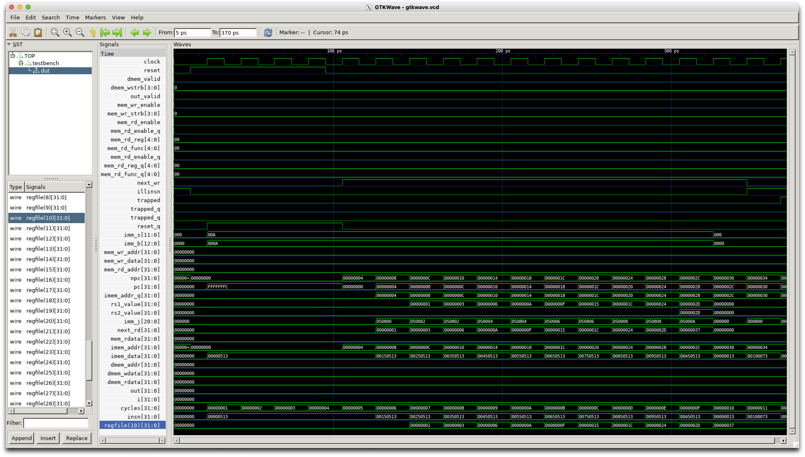
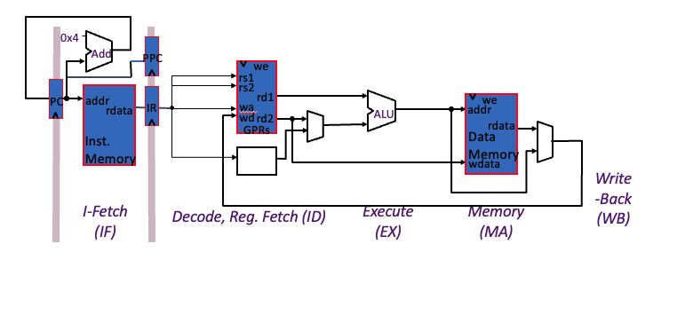

# Pipelined RV32 (Part 1 of 2)

In this lab you will convert the single-cycle RISC-V (RV) processor
to execute using a simple 2-stage pipeline.

If you have previously downloaded all the labs using ```git clone https://github.com/phwl/elec3608-lab.git```, you should first type ```git pull``` to download any recent changes. **Please note that we are using a different docker image (```elec3608-cad:latest```) for this lab, executed as:**
```bash
$ docker run --platform linux/amd64 -it -e DISPLAY=host.docker.internal:0 -v `pwd`:/config phwl/elec3608-cad:latest
```

In your lab book, clearly explain the changes that you needed to make
to answer each question and include screen shots of your simulations
and terminal output.

## Lab Questions
### Part 1 - Datapath for Sequential Pipelined Execution (20%)
The starting point for this lab is a lightly-modified version of the complete single-cycle [nerv processor](https://github.com/YosysHQ/nerv) in ```nerv.sv``` (which stands for nerv single cycle). Note that this is a little more complex but not significantly different to the processors you have seen to date.

Draw the datapath of this processor and, in a table, describe the operation of each of the control signals. Put this information in your lab book.

### Part 2 - Sequential Instructions (30%) 
Study the ```firmware.s``` program, listed below. 

```assembly
    .section .text
    .global main
    .global _start
    _start:
    addi x10, zero, 0
    addi x10, x10, 1
    addi x10, x10, 2
    addi x10, x10, 3
    addi x10, x10, 4
    addi x10, x10, 5
    addi x10, x10, 6
    addi x10, x10, 7
    addi x10, x10, 8
    addi x10, x10, 9
    addi x10, x10, 10
    nop
    ebreak
```
The program simply sums the first 10 non-negative integers and the result is 55. To test this program on the single cycle processor you can just type
```make```. In GTKWave, you can view additional waveforms by expanding
the "testbench" module in the top left window, clicking "dut" and then appending the desired waveforms. In the plot below, "regfile(10)[31:0]" and "insn[31:0]" were appended and you can see that the final value in regfile(10) was 0x37 as expected.



Modify the single cycle processor so that it implements a 2-stage pipeline as illustrated below. Your design need only do enough to execute this program. Using GTKWave, display the values of your pipeline registers and write a justification in your lab book as to why your solution is correct.



### Part 3 - FPGA Synthesis (20%)

Execute the shell command
```bash
make nerv.asc
```

This will first run [yosys](https://yosyshq.net/yosys/) which maps
your design to the primitive elements of an FPGA. It then runs
[nextpnr](https://github.com/YosysHQ/nextpnr) which will place and
route your design on the FPGA and determine the maximum clock
frequency. The target platform is the [Lattice
iCE40-HX8k](https://www.latticesemi.com/iCE40).

Look in the ```nerv-pnr.log``` file. The last part looks like this
```
...
Info: 9.3 ns logic, 17.6 ns routing

Info: Max frequency for clock 'clock$SB_IO_IN_$glb_clk': 38.21 MHz (PASS at 12.00 MHz)

Info: Max delay <async>                         -> <async>                        : 29.84 ns
Info: Max delay <async>                         -> posedge clock$SB_IO_IN_$glb_clk: 29.03 ns
Info: Max delay posedge clock$SB_IO_IN_$glb_clk -> <async>                        : 26.98 ns

Info: Slack histogram:
Info:  legend: * represents 17 endpoint(s)
Info:          + represents [1,17) endpoint(s)
Info: [ 53495,  54935) |*+
Info: [ 54935,  56375) |****+
Info: [ 56375,  57815) |*********+
Info: [ 57815,  59255) |***************************************+
Info: [ 59255,  60695) |************************+
Info: [ 60695,  62135) |************************************+
Info: [ 62135,  63575) |************************************************************ 
Info: [ 63575,  65015) |***************+
Info: [ 65015,  66455) |**+
Info: [ 66455,  67895) |+
Info: [ 67895,  69335) |*+
Info: [ 69335,  70775) |**********+
Info: [ 70775,  72215) |**************************************+
Info: [ 72215,  73655) |***********+
Info: [ 73655,  75095) |***+
Info: [ 75095,  76535) |+
Info: [ 76535,  77975) |+
Info: [ 77975,  79415) |+
Info: [ 79415,  80855) |*+
Info: [ 80855,  82295) |+
184 warnings, 0 errors

Info: Program finished normally.
```

The reported maximum clock frequency is 38.21 MHz. Also note that
the routing delay is much higher than the logic delay - this is typical
in an FPGA.
Replace ```nerv.sv``` with your pipelined design. What is the new clock
frequency?

### Part 4 - Placement of Pipeline Registers (30%)
Reposition the pipeline registers to before the input to the ALU. This will result in better balancing of the pipeline stages and you should be able to achieve > 45 MHz. In your design you need to 
completely bisect the datapath so that all the information to execute
the remaining part of the instruction is passed to the next stage. In 
your lab book, redraw the data path showing where you located the
registers and explain which intermediate nodes need to be registered.
Give the frequency achieved and include the changes to the original 
Verilog design and nextpnr log file as an appendix.
Also give the reported clock frequency. 

Your design for this part of the lab does not need to be simulated for correctness, this will be addressed in the assignment.
