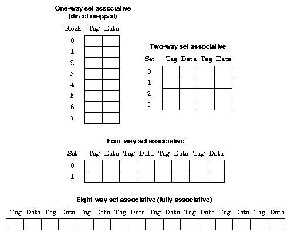

# Lab 7 - Cache Simulation

The goals of this lab are:

* Improve understanding of the impact of cache parameters on performance
* Provide an example of how researchers evaluate different parameters.

In this lab, you will experiment with the design of a cache system for the RISCV processor using the spike simulator (under the virtual machine from the previous lab). Spike simulates a variety of cache configurations, where the various cache parameters (e.g. associativity level, cache size, block size) can be specified on the command line.

If you have previously downloaded all the labs using git clone https://github.com/phwl/elec3608-lab.git, you should first type ```git pull``` to download any recent changes. Please note that we are using a different docker image (elec3608-riscv:latest) for this lab, executed as:

You can run the Docker using:

```
../common/rundocker phwl/elec3608-riscv:latest
```

The command line arguments for spike can be obtained by invoking spike with the -h argument:

```
elec3608@0dd8d89260a4:~$ spike -h
Spike RISC-V ISA Simulator 1.1.1-dev

usage: spike [host options] <target program> [target options]
Host Options:
  -p<n>                 Simulate <n> processors [default 1]
  -m<n>                 Provide <n> MiB of target memory [default 2048]
  -m<a:m,b:n,...>       Provide memory regions of size m and n bytes
                          at base addresses a and b (with 4 KiB alignment)
  -d                    Interactive debug mode
  -g                    Track histogram of PCs
  -l                    Generate a log of execution
  -h, --help            Print this help message
  -H                    Start halted, allowing a debugger to connect
  --log=<name>          File name for option -l
  --debug-cmd=<name>    Read commands from file (use with -d)
  --isa=<name>          RISC-V ISA string [default RV32I]
  --priv=<m|mu|msu>     RISC-V privilege modes supported [default MSU]
  --varch=<name>        RISC-V Vector uArch string [default vlen:128,elen:64]
  --pc=<address>        Override ELF entry point
  --hartids=<a,b,...>   Explicitly specify hartids, default is 0,1,...
  --ic=<S>:<W>:<B>      Instantiate a cache model with S sets,
  --dc=<S>:<W>:<B>        W ways, and B-byte blocks (with S and
  --l2=<S>:<W>:<B>        B both powers of 2).
  --device=<P,B,A>      Attach MMIO plugin device from an --extlib library
                          P -- Name of the MMIO plugin
                          B -- Base memory address of the device
                          A -- String arguments to pass to the plugin
                          This flag can be used multiple times.
                          The extlib flag for the library must come first.
  --log-cache-miss      Generate a log of cache miss
  --log-commits         Generate a log of commits info
  --extension=<name>    Specify RoCC Extension
                          This flag can be used multiple times.
  --extlib=<name>       Shared library to load
                        This flag can be used multiple times.
  --rbb-port=<port>     Listen on <port> for remote bitbang connection
  --dump-dts            Print device tree string and exit
  --dtb=<path>          Use specified device tree blob [default: auto-generate]
  --disable-dtb         Don't write the device tree blob into memory
  --kernel=<path>       Load kernel flat image into memory
  --initrd=<path>       Load kernel initrd into memory
  --bootargs=<args>     Provide custom bootargs for kernel [default: console=hvc0 earlycon=sbi]
  --real-time-clint     Increment clint time at real-time rate
  --dm-progsize=<words> Progsize for the debug module [default 2]
  --dm-sba=<bits>       Debug system bus access supports up to <bits> wide accesses [default 0]
  --dm-auth             Debug module requires debugger to authenticate
  --dmi-rti=<n>         Number of Run-Test/Idle cycles required for a DMI access [default 0]
  --dm-abstract-rti=<n> Number of Run-Test/Idle cycles required for an abstract command to execute [default 0]
  --dm-no-hasel         Debug module supports hasel
  --dm-no-abstract-csr  Debug module won't support abstract to authenticate
  --dm-no-halt-groups   Debug module won't support halt groups
  --dm-no-impebreak     Debug module won't support implicit ebreak in program buffer
  --blocksz=<size>      Cache block size (B) for CMO operations(powers of 2) [default 64]
```

We will use the dhrystone program, located in the ```dhrystone``` directory, as a benchmark. Compile and run with the following commands:

```
elec3608@26cc6d7c5b94:~$ cd dhrystone
elec3608@0dd8d89260a4:~/dhrystone$ ls
Makefile  dhrystone.c  user-guide.txt
elec3608@0dd8d89260a4:~/dhrystone$ make
riscv32-unknown-elf-gcc -march=rv32i -w dhrystone.c -o dhrystone
elec3608@0dd8d89260a4:~/dhrystone$ make run
spike --isa=rv32i --ic=2:4:8 --dc=2:4:8  /opt/riscv/riscv32-unknown-elf/bin/pk dhrystone
bbl loader
Dhrystone(1.1) time for 50000 passes = 155648
This machine benchmarks at -1 dhrystones/second
D$ Bytes Read:            39075708
D$ Bytes Written:         22011896
D$ Read Accesses:         10884195
D$ Write Accesses:        6240713
D$ Read Misses:           2802283
D$ Write Misses:          2849419
D$ Writebacks:            3559266
D$ Miss Rate:             33.003%
I$ Bytes Read:            155046552
I$ Bytes Written:         0
I$ Read Accesses:         38761638
I$ Write Accesses:        0
I$ Read Misses:           19622727
I$ Write Misses:          0
I$ Writebacks:            0
I$ Miss Rate:             50.624%
```

the above simulated a RISCV processor with the following cache

```
S=2 sets
W=4 ways
B=8-byte blocks.
```

To see how sets and ways interact, this figure which shows four configurations of 8-block caches is helpful



A direct mapped cache has ways=1, and a fully associative cache has sets=1. The total size of the cache in bytes is S*W*B (or S*W blocks). 

## Question 1

The easiest way to do this lab is by writing one or more programs (in your favourite language such as C, C++ or python) that automates the tasks. My suggestion is to use python which is installed in the docker image. Subsequent plotting and data analysis can be done using MS excel, MATLAB or other tools. Although you can do it manually, it would be slow, inflexible and error-prone.

a. (20%) Assume that the hit time is 1 cycle and the miss penalty is 10 cycles. For the I$ and D$ cache simulations given in the example above, what is the average memory access time (AMAT) for each? Show your working.

b. (50%) A RISCV processor has no L2 cache, the instruction and data caches are identical, direct mapped caches and have 16-byte blocks. Plot instruction and data miss rates as a function of the cache size (which are powers of 2) on a single graph for the dhrystone program. What cache size is required to obtain a miss rate of less than 5% for the instruction and data cache?

c. (30%) Suppose that memory costs ($0.1 + $0.0001 * b) where b is the size of the cache in bytes. We wish to minimise (AMAT * memory cost) for the L1 cache over the dhrystone application. Constraints are that the data (D) and instruction (I) caches can be different sizes, but each cache's S, W and B must be a power of 2. What are the cache parameters (S:W:B) that should be chosen for the I cache and the D cache?
